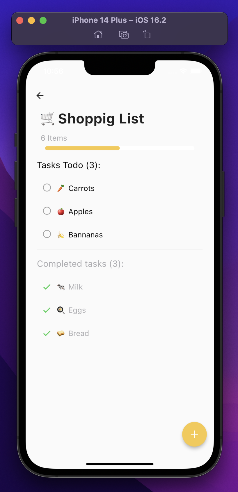

# Get(ItDone)X - Toodat assignment
Welcome to Get(ItDone)X, a simple Flutter todo app, so named because it uses GetX for state management...see what I did there ;)
<p float="left">
 
 
 
 
</p>

## Running the Flutter project 🔧
Simply run:
```
$ flutter pub get
$ flutter run
```
_I have tested this project on both iOS and Android emulators, as well as a physical iOS device, please let me know if you run into any problems with running the app_
## About the app ⚙️
The app is built following the MVC design pattern. The app uses the ```get_storage```, a package developed by the GetX maintainers, as fast, synchronous, key-value in memory storage, which backs up data to the disk at each operation. 
## App functionality ⚡️
As requested the app features full CRUD functionality for todo lists. 
Users can create, update and delete todo lists. Users can also add new todo items to a list. As well as change the state of an item form "in progress" to done. Users can delete items from the list that are in progress or done. 

For a full demo of the app's functionality please have a look at: https://www.youtube.com/watch?v=33Eceo71IU8

I hope that you enjoy using the app :)!
